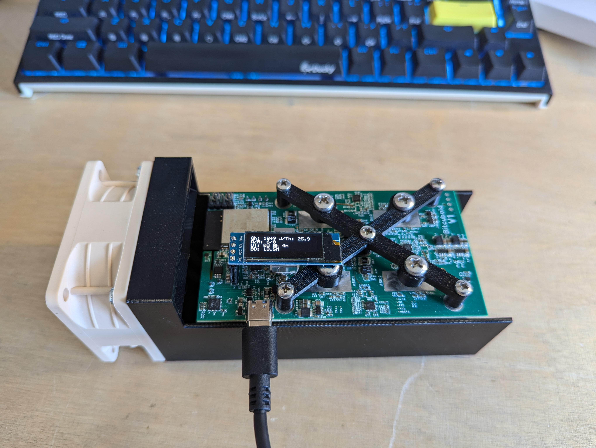
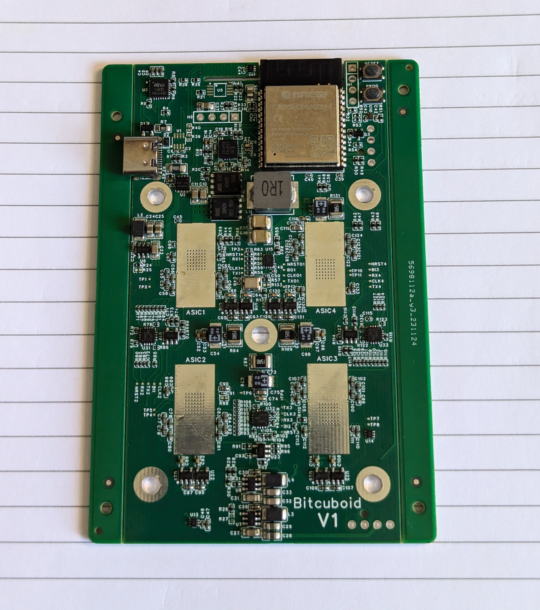
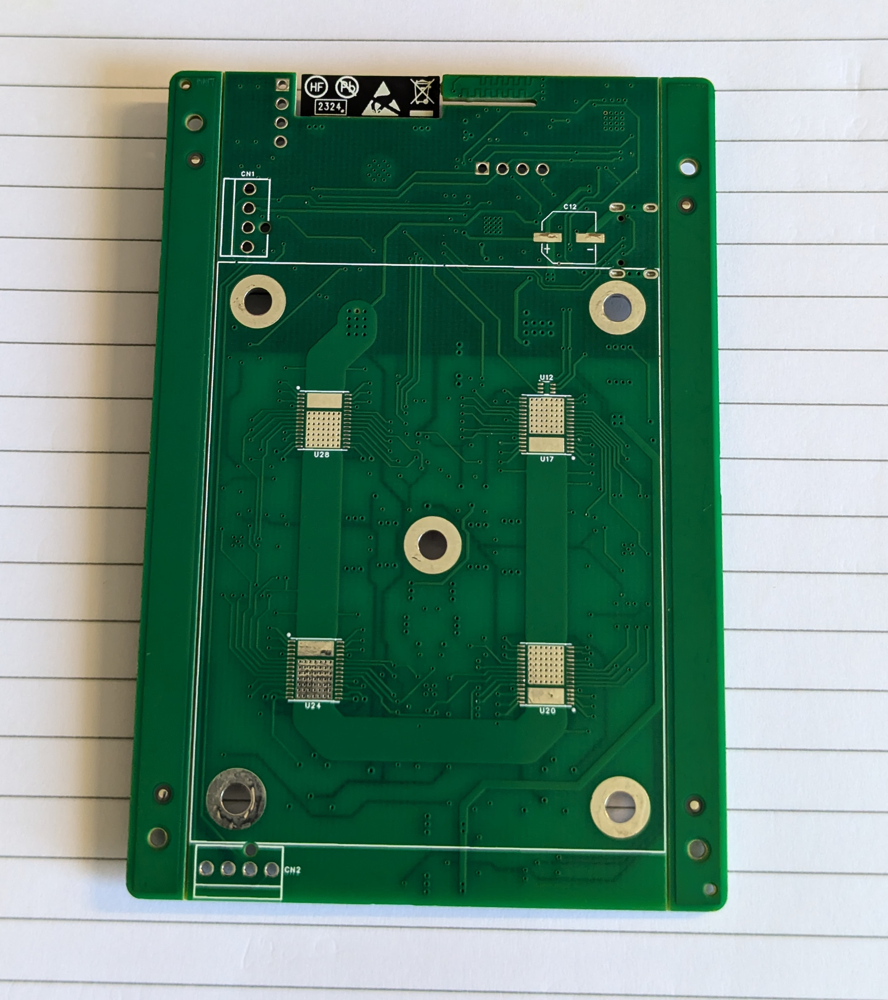
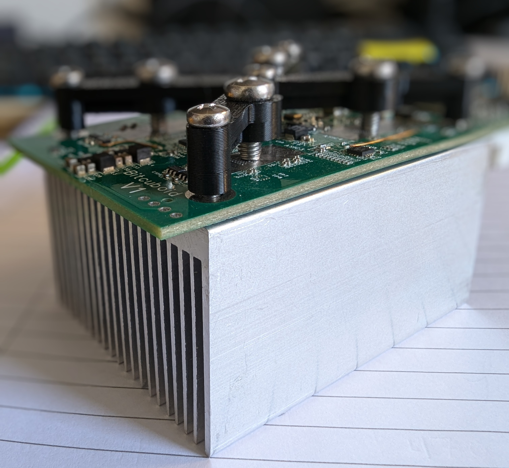
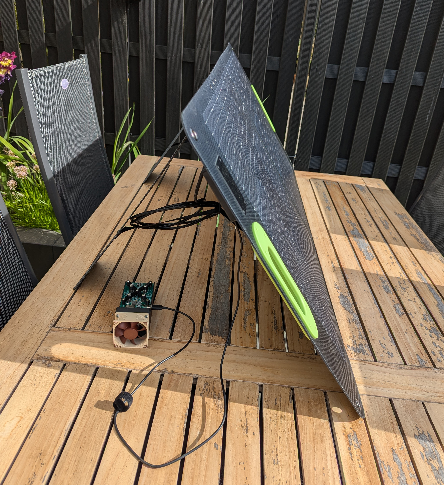

# Bitcuboid
Bitcuboid is an open software/hardware Bitcoin miner. It's based on the Bitaxe but contains 4 ASICs and is powered over USB type C.
Bitcuboid contains 4 Bitmain BM1366 ASIC's as found on the S19XP.

Bitcuboid in its 3D printed development case (for easy access):

## Features
- **ESP32-C6-WROOM-1** RISC-V core + WiFi in a single module
- 0.91" **SSD1306 OLED** I2C Display Module
- **USB-C PD** support for power negotiation
- 4 BM1366 ASICs
- Air temperature sensing on in- and output for heating applications
- Designed for **Noctual A6 PWM** (60mm) fans: Optional second fan connection for overclocking.

The original idea was to mount the PCB on top of the heatsink with 5 screws.
When tightening the screws the PCB started to bend slightly over the ASICs which
wasn't ideal. Pressure needs to be applied directly to the back of the ASICs
to be able to press them firmly onto the heatsink. Thats why the 3D printed cross
was added. It's pulled down by the M3 screws and applies pressure at the back of
the ASICS with the M4 screws.

## Software
- The [ESP-Miner](https://github.com/rvdgracht/ESP-Miner) firmware used for the Bitaxe has been adapted for Bitcuboid.

## Power Supply Requirements
- A 65W (or more) USB type C charger supporting 20V and >= 2.5A. Bitcuboid with default setting needs about 45W.

There are portable 100W solar panels with USB type C output :P

